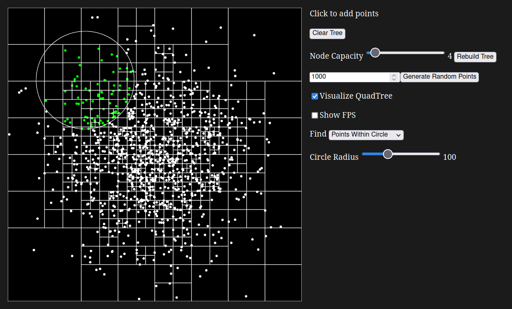
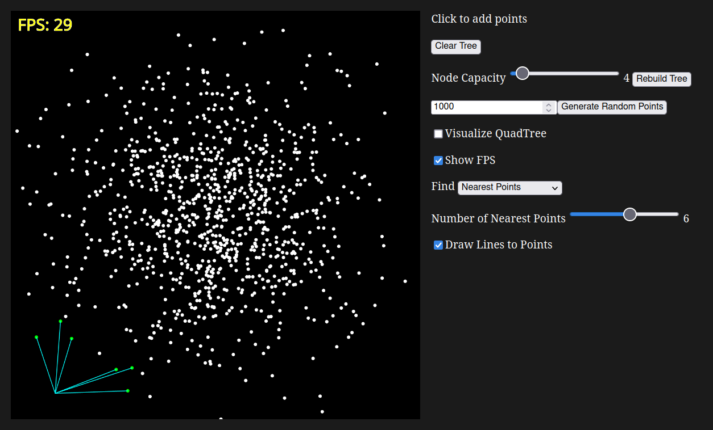

# p5.js QuadTree Visualization

Basic implementation of a quadtree algorithm in p5.js

## Current Features

- Visualize QuadTree nodes
- Insert new point at mouse when clicked
- Add customizable number of random points
- Customize node capacity
- Rebuild tree on demand
- Search for points in the area within a circle or square
- Find n points nearest to the mouse location

## Screenshots

